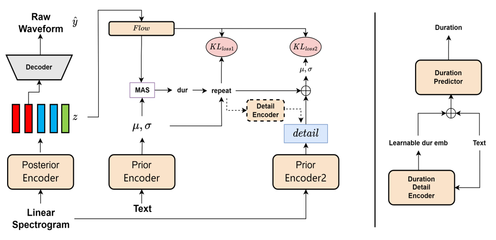

# TTTS_v4



## Introduce
To the best of my knowledge, the method in this project is the first of its kind that I have proposed. The main idea stems from the modeling of 'detail', as I have been troubled by the fact that VQ (Vector Quantization) based methods cannot reconstruct audio very well, and there is also no way to model this residual. However, for traditional VITS, there are ways to create some supervisory signals, such as linear spectra, or by using learnable embeddings to learn the duration. These observations ultimately led to this method achieving very good results.

# Demo
[](https://colab.research.google.com/github/adelacvg/ttts/blob/v4/demo.ipynb)

# Install
```
pip install -e .
```
# Training

### 1. Tokenizer training
Use the `ttts/prepare/bpe_all_text_to_one_file.py` to merge all text you have collected. To train the tokenizer, check the `ttts/gpt/voice_tokenizer` for more info.

### 2. VQVAE training
Use the `1_vad_asr_save_to_jsonl.py` and `2_romanize_text.py` to preprocess dataset.
Use the following instruction to train the model.
```
accelerate launch ttts/vqvae/train_v3.py
```

# Multi Language
Now support Chinese, English, Japanese, Korean.

You can use any language with this model with two step.
- First, collect many text of this language.
- Second, train the `ttts/gpt/voice_tokenizer` to get a dictionary.

For English, you can directly use the text. However, for Chinese, you need to use Pinyin, and for Japanese, you need to use Romaji, making sure to include pronunciation information in the text.

# Inference

Please check the `api.py` for inference detail.

# FineTuning

Change the load path in train_v3.py with pretrained model, then train it.
About the dataset, your should preprocess the text and audio path and latin. You can refer to `ttts/prepare/2_romanize_text.py` for some info.

# Acknowledgements
- [Tortoise](https://github.com/neonbjb/tortoise-tts) which is the start of this repo.
- [VITS](https://github.com/jaywalnut310/vits) most of which the code is based on.
- [Bert-VITS2](https://github.com/fishaudio/Bert-VITS2) some optimized code like mas is from here.